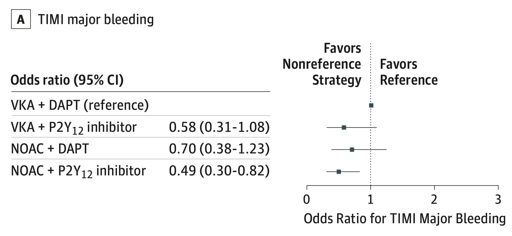

```{r setup, include=FALSE}
knitr::opts_chunk$set(echo = TRUE)
library(tidyverse)
library(R2jags)
library(gemtc)
library(tibble)
ggplot2::theme_set(ggplot2::theme_bw())
knitr::opts_chunk$set(out.width = "100%", fig.align = 'center')
source('Models.R')
```

```{r}
set.seed(2023)

######## Import data
bleed <- read.table("Data_Bleeding.csv", sep=",", header=TRUE)
mace <- read.table("Data_MACE.csv", sep=",", header=TRUE)

######## Row 7 and 8 need to be combined
bleed[7,3:7] = bleed[7,3:7] + bleed[8,3:7]
bleed <- bleed[-8,]
mace[7,3:10] = mace[7,3:10] + mace[8,3:10]
mace <- mace[-8,]


Bleed_data <- bleed[,c("study", "treatment", "n", "TIMImajor")]
Bleed_data = Bleed_data[1:(nrow(Bleed_data)-2), ]

MACE_data <- mace[,c("study", "treatment", "n", "MACE")]        
MACE_data = MACE_data[1:(nrow(MACE_data)-2), ]


## Note: A is reference

trt <- c("A","B", "C","D")
# trt <- c("VKA + DAPT", "VKA + P2Y12", "NOAC + DAPT", "NOAC + P2Y12")

trts <- read.table(textConnection('id description
                                  A "VKA + DAPT"
                                  B "VKA + P2Y12"
                                  C "NOAC + DAPT"
                                  D "NOAC + P2Y12"'), header=TRUE)


Bleed_data$treatment <- trt[Bleed_data$treatment]
colnames(Bleed_data) = c("study","treatment", "sampleSize","responders")
MACE_data$treatment <- trt[MACE_data$treatment]
colnames(MACE_data) = c("study","treatment", "sampleSize","responders")
```

```{r}
network <- mtc.network(data.ab=Bleed_data, treatments=trts)
plot(network)
cons.model <- mtc.model(network, type="consistency", likelihood="binom", link="logit", linearModel="random", 
                        hy.prior =  mtc.hy.prior(type="std.dev", distr="dunif", 0.01, 10),
                        re.prior.sd = 10)
cons.out <- mtc.run(cons.model, n.adapt=20000, n.iter=5000, thin=1)
summary(cons.out)
gemtc::forest(cons.out)

gemtc_trt_results = cbind(mean = summary(cons.out)$summaries$statistics[1:3,1], 
                        summary(cons.out)$summaries$quantiles[1:3,c(1,5)]) %>% as.data.frame()

gemtc_trt_results
```


```{r}
# data pre for jags
NS = 4
NT = 4
N = nrow(Bleed_data)
s = Bleed_data$study
t = Bleed_data$treatment
t = c(1,2,1,3,4,1,4,1,2,3,4)
y = Bleed_data$responders
n = Bleed_data$sampleSize
drug_list<-unique(Bleed_data$treatment)
Narm <- as.numeric(table(Bleed_data$study))
n.obs <- matrix(NA,nrow=NS, ncol=max(Narm))
n.eve <- matrix(NA,nrow=NS, ncol=max(Narm))
dr <- matrix(NA,nrow=NS, ncol=max(Narm))
```


```{r}
######## Fit AB model
data_AB <- list('Narm'=N, 'Nstudy'=NS, 
                'Ndrug'=NT, 'study'= s, 'drug'=t, 
                'y'=y, 'n'=n ,'Omega'=diag(rep(0.2,times=4)),
                'zero.AB' = (rep(0, times=4)))
inits_AB<- list(list(mu=rep(0,4)),
                list(mu=rep(0,4)))
para_AB<-c( "lor", "tau", "best1", "best2", "best3")
fit_AB<-jags(data=data_AB, inits=inits_AB, para_AB,
             n.iter=20000, n.burnin = 5000, n.chains = 2, n.thin = 1,
             DIC=TRUE, model.file=ABWish)
#output data 
fit_AB$BUGSoutput$summary[,c(1, 3, 7)]
#saving treatment effect output
AB_trt_results<-data.frame(fit_AB$BUGSoutput$summary[,c(1, 3, 7)])
AB_trt_results <- tibble::rownames_to_column(AB_trt_results, "drug_list")
AB_trt_results<-AB_trt_results%>%
  filter(drug_list %in% c("lor[1]", "lor[2]", "lor[3]", "lor[4]"))


ABresults<-AB_trt_results%>%
  mutate(LL = as.numeric(X2.5.), 
         UL = as.numeric(X97.5.), 
         mean = as.numeric(mean))%>%
  filter(!(drug_list==1))
ggplot(ABresults, aes(y = drug_list, x =mean )) +
  geom_point(shape = 18, size = 5) +  
  geom_errorbarh(aes(xmin = LL, xmax = UL), height = 0.25)+
  theme(panel.border = element_blank(),
        panel.background = element_blank(),
        panel.grid.major = element_blank(), 
        panel.grid.minor = element_blank())+
  labs(y = "", x="", title = "Arm-Based NMA Treatments LOR")

########

AB_trt_results
```


```{r}
#Lu and Ades Model with Random Effects Model Function

### Running the LARE Model ### 
##Additional data preparation for this model 
study<-unique(Bleed_data$study)
for (i in 1:NS){
  n.obs[i,1:Narm[i]] <- Bleed_data$sampleSize[Bleed_data$study==study[i]]
  n.eve[i,1:Narm[i]] <- Bleed_data$responders[Bleed_data$study==study[i]]
  dr[i,1:Narm[i]] <- match(Bleed_data$treatment[Bleed_data$study==study[i]],drug_list)
}


##putting data into list form
data_LA <- list('Narm'=Narm, 'Nstudy'=NS,'Ndrug'=NT, 'drug'=dr,'y'=n.eve,'n'=n.obs) 
init_LA <- list(list(mu=rep(0,max(NS)), d=c(NA,rep(0,max(t)-1))),
             list(mu=rep(0,max(NS)), d=c(NA,rep(0,max(t)-1))))
para_LA <- c('d','tau','best1', 'best2', 'best3')
fit_LA <- jags(data=data_LA, inits=init_LA, para_LA,
                     n.iter=20000, n.burnin = 5000, n.chains = 2, n.thin = 1,
                     DIC=TRUE, model.file=LARE)
#output data 
fit_LA$BUGSoutput$summary[,c(1, 3, 7)]

#saving treatment effect output
LA_trt_results<-data.frame(fit_LA$BUGSoutput$summary[,c(1, 3, 7)])
LA_trt_results <- tibble::rownames_to_column(LA_trt_results, "drug_list")
LA_trt_results<-LA_trt_results%>%
  filter(drug_list %in% c("d[1]", "d[2]", "d[3]", "d[4]"))
LA_trt_results
```


```{r}
### Running Contrast Based  Model  ########
data_CB <- list('Narm'=N, 'Nstudy'=NS, 
                  'Ndrug'=NT, 'study'= s, 'drug'=t, 
                  'y'=y, 'n'=n ,'Omega'=diag(rep(0.2,times=4)))
inits_CB <- list(list(mu=rep(0,max(NS)), d=c(NA,rep(1,max(t)-1))),
             list(mu=rep(0,max(NS)), d=c(NA,rep(0,max(t)-1))))

para_CB<-c( "d", "tau", "best1", 'best2', 'best3')
fit_CB<-jags(data=data_CB, inits=inits_CB, para_CB,
                n.iter=20000, n.burnin = 5000, n.chains = 2, n.thin = 1,
                DIC=TRUE, model.file=CBWish)

#output data 
fit_CB$BUGSoutput$summary[,c(1, 3, 7)]
#saving treatment effect output
CB_trt_results<-data.frame(fit_CB$BUGSoutput$summary[,c(1, 3, 7)])
CB_trt_results <- tibble::rownames_to_column(CB_trt_results, "drug_list")
CB_trt_results<-CB_trt_results%>%
  filter(drug_list %in% c("d[1]", "d[2]", "d[3]", "d[4]"))
CB_trt_results
```


```{r}
gemtc_trt_results
AB_trt_results
LA_trt_results
CB_trt_results
```

```{r}
gemtc::forest(relative.effect(cons.out, "A", c("B","C","D")))
gemtc_trt_results <- rownames_to_column(gemtc_trt_results, var = "drug_list")
```

```{r}

```


```{r}
#### Cleaning the data before running the forest plot #### 
Gemtc_Result<-gemtc_trt_results%>%
  mutate(LL = as.numeric(exp(`2.5%`)), 
         UL = as.numeric(exp(`97.5%`)), 
         mean = as.numeric(exp(mean)))

ABresults<-AB_trt_results%>%
  mutate(LL = as.numeric(exp(X2.5.)), 
         UL = as.numeric(exp(X97.5.)), 
         mean = as.numeric(exp(mean)))%>%
  filter(!(drug_list=="lor[1]"))
CBresults<-CB_trt_results%>%
  mutate(LL = as.numeric(exp(X2.5.)), 
         UL = as.numeric(exp(X97.5.)), 
         mean = as.numeric(exp(mean)))%>%
  filter(!(drug_list=="d[1]"))
LAresults<-LA_trt_results%>%
  mutate(LL = as.numeric(exp(X2.5.)), 
         UL = as.numeric(exp(X97.5.)), 
         mean = as.numeric(exp(mean)))%>%
  filter(!(drug_list=="d[1]"))

LAresults$drug_list = Gemtc_Result$drug_list
CBresults$drug_list = Gemtc_Result$drug_list
ABresults$drug_list = Gemtc_Result$drug_list
```


````{r, fig.width = 6, fig.height = 7}
##Runnning forest plots##
##plot in OR scale, not log OR! 

gridExtra::grid.arrange(
ggplot(Gemtc_Result, aes(y = drug_list, x =mean )) +
  scale_y_discrete(limits=rev) + 
  geom_point(shape = 18, size = 5) +  
  geom_errorbarh(aes(xmin = LL, xmax = UL), height = 0.25)+
  geom_vline(xintercept = 1, color = "blue", linewidth=1.5) + 
  xlim(0,2) + 
  theme(panel.border = element_blank(),
        panel.background = element_blank(),
        panel.grid.major = element_blank(), 
        panel.grid.minor = element_blank())+
  labs(y = "", x="", title = "GEMTC NMA Treatments Effects"), 
ggplot(LAresults, aes(y = drug_list, x =mean )) +
  scale_y_discrete(limits=rev) + 
  geom_point(shape = 18, size = 5) +  
  geom_errorbarh(aes(xmin = LL, xmax = UL), height = 0.25)+
  geom_vline(xintercept = 1, color = "blue", linewidth=1.5) + 
  theme(panel.border = element_blank(),
        panel.background = element_blank(),
        panel.grid.major = element_blank(), 
        panel.grid.minor = element_blank())+
  xlim(0,2) + 
  labs(y = "", x="", title = "Lu and Ades NMA Treatments Effects") ,
ggplot(CBresults, aes(y = drug_list, x =mean )) +
  geom_point(shape = 18, size = 5) +  
  geom_errorbarh(aes(xmin = LL, xmax = UL), height = 0.25)+
  scale_y_discrete(limits=rev) + 
  geom_vline(xintercept = 1, color = "blue", linewidth=1.5) + 
  theme(panel.border = element_blank(),
        panel.background = element_blank(),
        panel.grid.major = element_blank(), 
        panel.grid.minor = element_blank())+
  xlim(0,2) + 
  labs(y = "", x="", title = "Contrast-Based NMA Treatments Effects") ,
ggplot(ABresults, aes(y = drug_list, x =mean )) +
  geom_point(shape = 18, size = 5) +  
  geom_errorbarh(aes(xmin = LL, xmax = UL), height = 0.25)+
  scale_y_discrete(limits=rev) + 
  geom_vline(xintercept = 1, color = "blue", linewidth=1.5) + 
  xlim(0,2)+ 
  theme(panel.border = element_blank(),
        panel.background = element_blank(),
        panel.grid.major = element_blank(), 
        panel.grid.minor = element_blank())+
  labs(y = "", x="", title = "Arm-Based NMA Treatments Effects"),
nrow = 4
)
```

```{r}
# result in OR scale 
Gemtc_Result[,-c(3,4)]
LAresults[,-c(3,4)]
CBresults[,-c(3,4)]
ABresults[,-c(3,4)]
```


```{r}
load("result_bleeding_all.RData")
result_bleeding_all %>% 
  mutate(Model = factor(Model,levels = c("GEMTC", "LA", "CB", "AB"))) %>%
  pivot_longer(cols = 1:3, names_to = "Comparison", values_to = "Power") %>% 
  ggplot() + geom_col(aes(x = Comparison, y = Power, fill = Model), position = position_dodge(0.8), width = 0.75)  + labs(x=" ") + ylim(0,0.5)
```


```{r}
load("result_bleeding_all2.RData")
result_bleeding_all %>% 
  mutate(Model = factor(Model,levels = c("GEMTC", "LA", "CB", "AB"))) %>%
  pivot_longer(cols = 1:3, names_to = "Comparison", values_to = "Power") %>% 
  ggplot() + geom_col(aes(x = Comparison, y = Power, fill = Model), position = position_dodge(0.8), width = 0.75)  + labs(x=" ") + ylim(0,0.5)

result_bleeding_all %>% 
  mutate(Model = factor(Model,levels = c("GEMTC", "LA", "CB", "AB"))) %>%
  pivot_longer(cols = 1:3, names_to = "Comparison", values_to = "Power") %>% 
  ggplot() + geom_col(aes(x = Model, y = Power, fill = Comparison), position = position_dodge(0.8), width = 0.75)  + labs(x=" ") + ylim(0,0.5)
```

```{r}
load("result_bleeding_all2.RData")
result_bleeding_all %>% 
  mutate(Model = factor(Model,levels = c("GEMTC", "LA", "CB", "AB"))) %>%
  filter(Model != "GEMTC") %>% 
  pivot_longer(cols = 1:3, names_to = "Comparison", values_to = "Power") %>% 
  ggplot() + geom_col(aes(x = Comparison, y = Power, fill = Model), position = position_dodge(0.8), width = 0.75)  + labs(x=" ") + ylim(0,0.5)

result_bleeding_all %>% 
  mutate(Model = factor(Model,levels = c("GEMTC", "LA", "CB", "AB"))) %>%
  filter(Model != "GEMTC") %>% 
  pivot_longer(cols = 1:3, names_to = "Comparison", values_to = "Power") %>% 
  ggplot() + geom_col(aes(x = Model, y = Power, fill = Comparison), position = position_dodge(0.8), width = 0.75)  + labs(x=" ") + ylim(0,0.5)
```


```{r}
load("result_bleeding_all3.RData")
result_bleeding_all %>% 
  mutate(Model = factor(Model,levels = c("GEMTC", "LA", "CB", "AB"))) %>%
  pivot_longer(cols = 1:3, names_to = "Comparison", values_to = "Power") %>% 
  ggplot() + geom_col(aes(x = Comparison, y = Power, fill = Model), position = position_dodge(0.8), width = 0.75)  + labs(x=" ")

result_bleeding_all %>% 
  mutate(Model = factor(Model,levels = c("GEMTC", "LA", "CB", "AB"))) %>%
  pivot_longer(cols = 1:3, names_to = "Comparison", values_to = "Power") %>% 
  ggplot() + geom_col(aes(x = Model, y = Power, fill = Comparison), position = position_dodge(0.8), width = 0.75)  + labs(x=" ")
```


