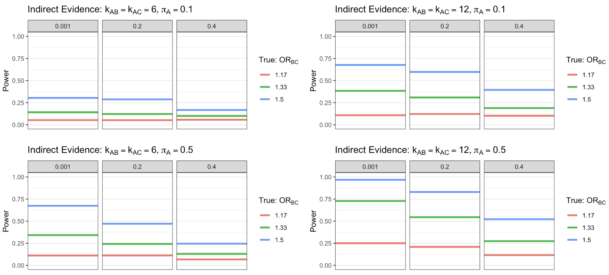
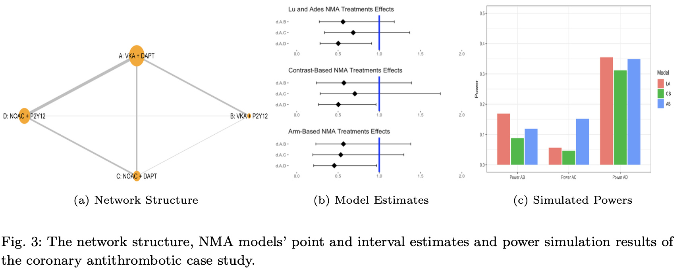
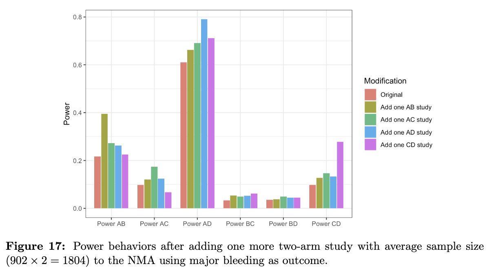

```{r setup, include=FALSE}
knitr::opts_chunk$set(echo = TRUE, cache = F, warning = F)
library(tidyverse)
library(mosaic)
library(kableExtra)
library(latex2exp)
ggplot2::theme_set(ggplot2::theme_bw())
knitr::opts_chunk$set(out.width = "80%", fig.align = 'center')
```


# Bayesian Network Meta-analysis

- Network meta-analysis, also commonly known as the mixed treatment comparison, is an extension of the pairwise meta-analysis

- It compares multiple treatments by combining all available evidence from randomized controlled trials (RCTs) to form a network of evidence, often including similar and related studies that investigate three or more treatment arms.
<!-- especially when there is not enough direct head-to-head comparison data to make reliable inference.  -->


```{r, echo=FALSE, eval = T, out.width = '65%'}

```


# Motivations

- The power of a hypothesis test is the probability that the test correctly rejects the null hypothesis ($H_0$) when a specific alternative hypothesis ($H_A$) is true, usually denote as $1-\beta$. 

- Powers are important, and there are lots of relevant analysis and implementation (like `G*Power` or the `pwr` R package). 

- There are a few blogs, packages (`dmetar::power.analysis`) and papers discussing power analysis, but mostly \textcolor{red}{in the context of MA.} (Hedges and Pigott, 2001; Valentine et al., 2010; Jackson and Turner, 2017; Kruschke and Liddell, 2018).

- Power analysis in NMA can be quite challenging, restricted and complicated, but is also meaningful to its operationalizations and communications. 


# Method

<!-- In this study, we fit both contrast-based and arm-based models to our simulated NMA data. -->


## (Generalized) Lu & Ades model

*Continuous outcomes*

For a network with $i = 1, ..., I$ studies and $k = 1, ..., K$ treatments: 
\begin{align*}
% \text{For a network with i = 1, ..., I studies }& \text{and k = 1, ..., K treatments: } \\
\text{Likelihood: }  \bar y_{ik} & \sim f_Y(y_{ik}| \Delta_{ik}, \xi_{ik}) =  N(\Delta_{ik}, \frac{\sigma^2_{ik}}{n_{ik}}) \\
g(\Delta_{ik}) = \Delta_{ik} & = \alpha_{iB} & \text{if } k = B \\
g(\Delta_{ik}) = \Delta_{ik} & = \alpha_{iB} + \delta_{iBk}  & \text{if } k \neq B \\
\delta_{iBk} & \sim N(d_{k} - d_{B}, \tau^2) 
\end{align*}

---

## (Generalized) Lu & Ades model

*Binary outcomes*

For a network with $i = 1, ..., I$ studies and $k = 1, ..., K$ treatments: 
\begin{align*}
\text{Likelihood: }  \bar y_{ik} & \sim f_Y(y_{ik}| \Delta_{ik}, \xi_{ik}) = \text{Binomial}(n_{ik}, \Delta_{ik}) \\
g(\Delta_{ik}) = \text{logit}(\Delta_{ik}) & = \alpha_{iB} & \text{if } k = B \\
g(\Delta_{ik}) = \text{logit}(\Delta_{ik}) & = \alpha_{iB} + \delta_{iBk}  & \text{if } k \neq B
\end{align*}


---


## Hong et al. 2015 

### CBRE

\begin{align*}
\text{Likelihood: }  \bar y_{ik} & \sim f_Y(y_{ik}| \Delta_{ik}, \xi_{ik}) \\
g(\Delta_{ik}) & = \theta_{ik} = \alpha_{i1} + d_{1k} + \eta_{i1k} \\
\boldsymbol{\eta}_i &= (\eta_{i12}, ...,  \eta_{i1K})^{\top} \sim N_{K-1}(0, \bf \boldsymbol{\Sigma}) 
\end{align*}


### ABRE

\begin{align*}
\text{Likelihood: }  \bar y_{ik} & \sim f_Y(y_{ik}| \Delta_{ik}, \xi_{ik})\\
g(\Delta_{ik}) & = \theta_{ik} = \mu_{k} + \eta_{ik} \\
\boldsymbol{\eta}_i &= (\eta_{i1}, ...,  \eta_{iK})^{\top} \sim N_K(0, \bf \boldsymbol{\Sigma}) \\
\text{Alternatively: } \boldsymbol{\theta}_i &= (\theta_{i1}, ...,  \theta_{iK})^{\top} \sim N_K(\boldsymbol{\mu}, \boldsymbol{\Sigma})  \text{ where } \boldsymbol{\mu} = (\mu_{1}, ...,  \mu_{K})^{\top}
\end{align*}


# Simulation study

## An motivating simulation design

<!-- - Study design  -->

```{r, milles, echo=FALSE, eval = T, out.width = '80%'}

```

---

## Intuitions of computing indirect evidence from Milles et al.


```{r, milles2, echo=FALSE, eval = T, out.width = '70%'}
knitr::include_graphics("Milles_idea.png")
```

---

## Simulation Design -- Data Generation Process


```{r, DGP, echo=FALSE, eval = T, out.width = '50%'}

```


---


## Results about powers from Milles et al.


```{r, milles3, echo=FALSE, eval = T, out.width = '100%'}

```


---


## Results about powers from Milles et al.


```{r, echo=FALSE, eval = T, out.width = '100%'}

```


---


*Improvements over Miles et al. (2011)*

\begin{enumerate}
  \item We synthesize both direct and indirect evidence and fit the NMA models through Bayesian approaches instead of a frequentist one.
  \item We simulate more realistic numbers of NMA studies, ranging from 1 to 6 studies of direct evidence and from 6 to 12 studies of indirect evidence. 
  \item We fit every simulated NMA data set with two types of aforementioned models, specifically LARE and ABRE models. 
  \item We examine powers of detecting more significant effect sizes that are more common in real cases, for example odds ratio of 1.17, 1.33 and 1.5.  
  \item We evaluate Type I and Type II error rates as well as probability of obtaining correct ranking orders of treatment effects rather than power results only. 
  \item We study more treatment arms and networks of different sizes and structures rather than only a three-arm network. 
\end{enumerate}


---


# Results

## Indirect evidence

```{r, echo=FALSE, eval = T, out.width = '95%'}

```

---

## Indirect evidence

```{r, echo=FALSE, eval = T, out.width = '95%'}
knitr::include_graphics("rank_indirect.png")
```

---

##  Direct evidence

```{r, echo=FALSE, eval = T, out.width = '95%'}

```


---

## Direct evidence

```{r, echo=FALSE, eval = T, out.width = '95%'}

```


---

## Indirect, direct & ovear powers in LARE

```{r, overallpower, fig.cap="Power behaviors of NMA using both indirect and direct evidence. Solid lines stand for powers from overall evidence. Dashed lines stand for powers from indirect evidence. Dotdahsed lines stand for powers from direct evidence.", echo=FALSE, eval = T, out.width = '100%'}

```

---

## Indirect, direct & ovear powers in ABRE

```{r, overallpower2, fig.cap="Power behaviors of NMA using both indirect and direct evidence. Solid lines stand for powers from overall evidence. Dashed lines stand for powers from indirect evidence. Dotdahsed lines stand for powers from direct evidence.", echo=FALSE, eval = T, out.width = '100%'}

```


---

## LARE vs. ABRE

```{r, echo=FALSE,out.width="49%",fig.show='hold',fig.align='center'}
knitr::include_graphics(c("LARE_in.png","ABRE_in.png"))
``` 

---

## Large vs. small studies


```{r, bigsmall, fig.cap="Power behaviors with rare and common outcomes and a total sample size of 3000.", echo=FALSE, eval = T, out.width = '100%'}

```


---


## Case Studies 

We considered three case studies, investigating coronary disease (Lopes et al., 2019), smoking cessation (Fiore et al., 1996) and Parkinson treatment (Franchini et al., 2012). 


```{r, case_study_design, echo=FALSE, eval = T, out.width = '85%'}

```

---

```{r, case_study, fig.cap="Network structures of three NMA case studies: each edge represents one treatment, connecting lines indicate randomized trials directly compare pairs of treatments.", echo=FALSE, eval = T, out.width = '85%'}

```


---

```{r, case_study_est, fig.cap="Point and interval estimates of NMA data under different models.", echo=FALSE, eval = T, out.width = '100%'}

```


---

```{r, case_study_power, fig.cap="Power estimates from different modeling approaches.", echo=FALSE, eval = T, out.width = '95%'}

```


--- 

### Case Study 1

```{r, echo=FALSE, eval = T, out.width = '105%'}

```

---

### Add one more study?

Adding more studies between two treatments usually greatly increases the power of detecting significant relative effects between these two treatments, if there is any. Meanwhile it can also improve our understanding of other edges in the network.

```{r, echo=FALSE, eval = T, out.width = '65%'}

```

---

### Case Study 2

```{r, echo=FALSE, eval = T, out.width = '105%'}

```

---

```{r, echo=FALSE, eval = T, out.width = '55%'}

```

---


### Case Study 3

```{r, echo=FALSE, eval = T, out.width = '105%'}

```
---


```{r, echo=FALSE, eval = T, out.width = '55%'}

```

---

THANK YOU!
